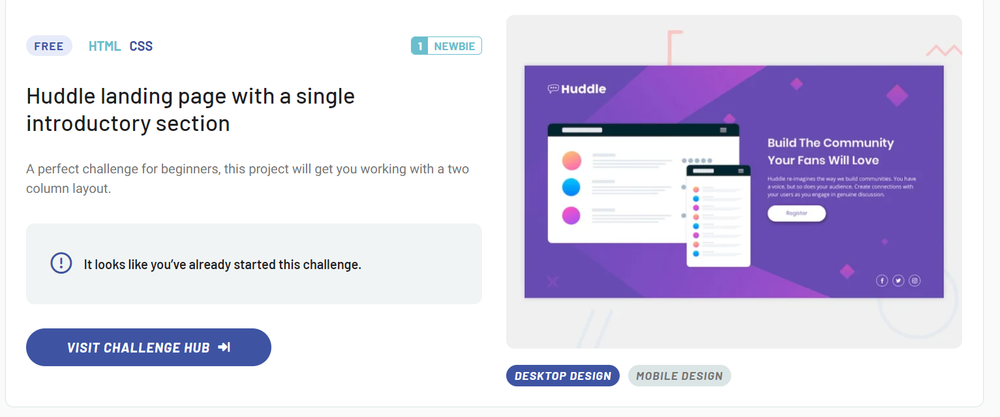

# Projeto do Frontend Mentor - Landing Page Huddle

Esta é uma solução para o [desafio de página de destino Huddle com seção introdutória única no Frontend Mentor](https://www.frontendmentor.io/challenges/huddle-landing-page-with-a-single-introductory-section-B_2Wvxgi0). Os desafios do Frontend Mentor ajudam você a melhorar suas habilidades de codificação construindo projetos realistas.


## Descrição
* Construa a comunidade que seus fãs vão amar

## Funcionalidades
* Criação de comunidades

## Tecnologias Utilizadas
* Frontend: HTML , CSS


## Índice
- [O desafio](#o-desafio)
- [Captura de tela](#captura de tela)
- [Links](#links)
- [Meu processo](#meu-processo)
- [Construído com](#construído-com)
- [O que aprendi](#o-que-aprendi)
- [Desenvolvimento contínuo](#desenvolvimento-continuo)
- [Recursos úteis](#recursos-úteis)
- [Autor](#autor)


**Observação: exclua esta observação e atualize o índice com base nas seções que você mantém.**

## Visão geral

### O desafio


 Criar o Projeto Huddle - com uma seção introdutoria
 usando HTML e CSS 


### Captura de tela

[]

### Resultado

- URL da solução: [Adicione a URL da solução aqui](https://your-solution-url.com)

## Meu processo

### Criado com

- Marcação HTML5 semântica
- Propriedades personalizadas CSS
- Flexbox
- Grid CSS

### O que aprendi

Aprendi neste Projeto a me aprofundar nos conteudo de FlexBox,
e a usar os espaçamentos: margin e padding com mais precisão
sendo o padding o mais complicado, por conta mais do responsivo 
que um erro no padding no codigo principal  ja faz o responsivo ficar errado.


```html
<h1>Alguns códigos CSS que me fez quebrar a cabeça um pouco./h1>
```
```css
 

.fa-instagram,
.fa-twitter {
    color: #fff;
    border: 1px solid white;
    padding: 5px;
    font-size: 4rem;
    border-radius: 50px;

}

 .container img {
    min-height: 372px;
    min-width: 375px;
    width: 375px;
    height: auto;
    object-fit: contain;
  }

```
```
```

### Desenvolvimento contínuo

Continuarei focando em projetos com estilo Landing Page , para cada vez mais me desenvolver nessa parte de estilos que eu acho bastante interessante .

### Recursos úteis

- [Discord da Guilda Devemdobro]() - Isso me ajudou para esclarecer minhas duvidas sobre posicionamento no CSS. Gostei muito  das respostas da comunidade e irei  usá-lo mais daqui para frente.


## Autor

- Site - [Gabriel Moraes](https://www.your-site.com)
- FrontEnd-mentor  [@Gabriel-Moraes023](https://www.frontendmentor.io/profile/Gabriel-Moraes023)


